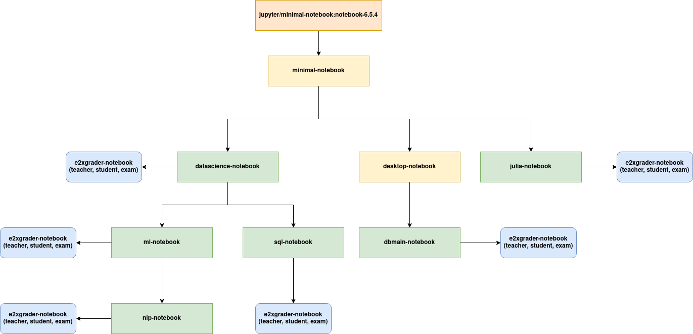

# E2x Docker Stacks

Ready to run docker images of the `e2x` project for various use cases. 
All images are hosted on `ghcr.io` and `quay.io`.

## Hub

All [hub images](hub) contain JupyterHub, [e2xhub](https://github.com/DigiKlausur/e2xhub), as well as authenticators.

## Jupyter Notebook Images

There are several Jupyter Notebook images for different use cases.
Currently all images are based on `notebook==6.5.4`.

| Image                | Base                                                                   | Teacher                                                                           | Student                                                                           | Exam                                                                        |
|----------------------|------------------------------------------------------------------------|-----------------------------------------------------------------------------------|-----------------------------------------------------------------------------------|-----------------------------------------------------------------------------|
| [minimal-notebook](images/minimal-notebook)     | [base](https://ghcr.io/digiklausur/docker-stacks/minimal-notebook)     |                                                                                   |                                                                                   |                                                                             |
| [datascience-notebook](images/datascience-notebook) | [base](https://ghcr.io/digiklausur/docker-stacks/datascience-notebook) | [teacher](https://ghcr.io/digiklausur/docker-stacks/datascience-notebook-teacher) | [student](https://ghcr.io/digiklausur/docker-stacks/datascience-notebook-student) | [exam](https://ghcr.io/digiklausur/docker-stacks/datascience-notebook-exam) |
| [ml-notebook](images/ml-notebook) | [base](https://ghcr.io/digiklausur/docker-stacks/ml-notebook) | [teacher](https://ghcr.io/digiklausur/docker-stacks/ml-notebook-teacher) | [student](https://ghcr.io/digiklausur/docker-stacks/ml-notebook-student) | [exam](https://ghcr.io/digiklausur/docker-stacks/ml-notebook-exam) |
| [nlp-notebook](images/nlp-notebook) | [base](https://ghcr.io/digiklausur/docker-stacks/nlp-notebook) | [teacher](https://ghcr.io/digiklausur/docker-stacks/nlp-notebook-teacher) | [student](https://ghcr.io/digiklausur/docker-stacks/nlp-notebook-student) | [exam](https://ghcr.io/digiklausur/docker-stacks/nlp-notebook-exam) |
| [sql-notebook](images/sql-notebook) | [base](https://ghcr.io/digiklausur/docker-stacks/sql-notebook) | [teacher](https://ghcr.io/digiklausur/docker-stacks/sql-notebook-teacher) | [student](https://ghcr.io/digiklausur/docker-stacks/sql-notebook-student) | [exam](https://ghcr.io/digiklausur/docker-stacks/sql-notebook-exam) |
| [julia-notebook](images/julia-notebook) | [base](https://ghcr.io/digiklausur/docker-stacks/julia-notebook) | [teacher](https://ghcr.io/digiklausur/docker-stacks/julia-notebook-teacher) | [student](https://ghcr.io/digiklausur/docker-stacks/julia-notebook-student) | [exam](https://ghcr.io/digiklausur/docker-stacks/julia-notebook-exam) |
| [desktop-notebook](images/desktop-notebook)     | [base](https://ghcr.io/digiklausur/docker-stacks/desktop-notebook)     |                                                                                   |                                                                                   |                                                                             |

The notebook images are:

* [Minimal Notebook](images/minimal-notebook/): Base image used for all other images here.
* [Data Science Notebook](images/datascience-notebook/): Based on Minimal Notebook. Additional Python data science libraries (e.g., numpy, scipy, pandas, sklearn, statsmodels). 
* [Machine Learning Notebook](images/ml-notebook/): Based on Data Science Notebook. Additional Python machine learning libraries (e.g., pytorch, gymnasium). 
* [Natural Language Processing Notebook](images/nlp-notebook/): Based on Machine Learning Notebook. Additional Python NLP libraries (e.g., nltk, spacy, gensim, transformers). 
* [SQL Notebook](images/sql-notebook/): Based on Data Science Notebook. Additional SQL libraries and kernels.
* [Julia Notebook](images/julia-notebook/): Based on Minimal Notebook. Adds a Julia kernel and libraries.
* [Desktop Notebook](images/desktop-notebook/): Based on Minimal Notebook. Customized version of the [Minimal Notebook](images/minimal-notebook) image, with an XFCE desktop installed using [Jupyter Remote Desktop Proxy](https://github.com/jupyterhub/jupyter-remote-desktop-proxy).
* [DB Main Notebook (experimental)](images/dbmain-notebook/): Based on Desktop Notebook. With the DB Main application installed. Serves as an example for running an application in a desktop image.

## E2xGrader Images

Each end-point image comes in four different flavors:

* Vanilla: Basic image without any e2xgrader extensions.
* Teacher: Includes `e2xgrader` with teacher mode activated and is intended for instructors for creating and grading assignments.
* Student: Includes `e2xgrader` with student mode activated and is intended for students for working on assignments.
* Exam: Includes `e2xgrader` with student_exam mode activated and is intended for students for working on exams, providing a restricted notebook.

## Build Tree

The following diagram illustrates the dependencies between the different images:

## Branches

The `dev` branch will always reflect `ghcr.io/digiklausur/docker-stacks/{image_name}:dev` on the GitHub container registry, and the `master` branch reflects `ghcr.io/digiklausur/docker-stacks/{image_name}:latest`. 

## Contributing

If you'd like to contribute to this repository, please feel free to open an issue or submit a pull request.

## License

The images in this repository are licensed under MIT.
